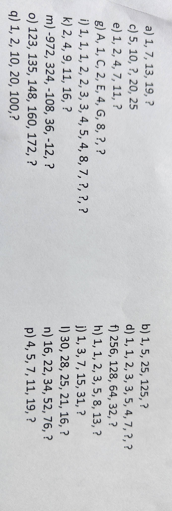
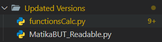

# Simple python projekty

## Souřadky
- Apka na výpočet souřadnic v mc
- apka trvala 1H 
- Naučil jsem se používát pořádně ify, formátované vypsání

## Kalkulačka
- Simple kalkulačka 
- Kalkulačka trvala 20 min
- Procvičil jsem si znova ify 👌

## Matika pŕíklady 🫠
- Vypočítal jsem každý příklad v matematice - posloupnosti
- Trvalo to asi 3h...
- Naučil jsem se pořádně používat range, porozuměl jsem jak fungují výpočty

## Vylepšení kódů 
- Byla vytvořena složka na nové verze, staré verze nechci aktualizovat abych viděl co jsem udělal jako první :D (Možná se přidá folder na staré verze)
- V nových verzích přepisuji starý kód (Který je např v Calculator, Matika) na víc readable
- Používám funkce na skrácení kódu
- Naućil jsem se funkca a začátek k polím

